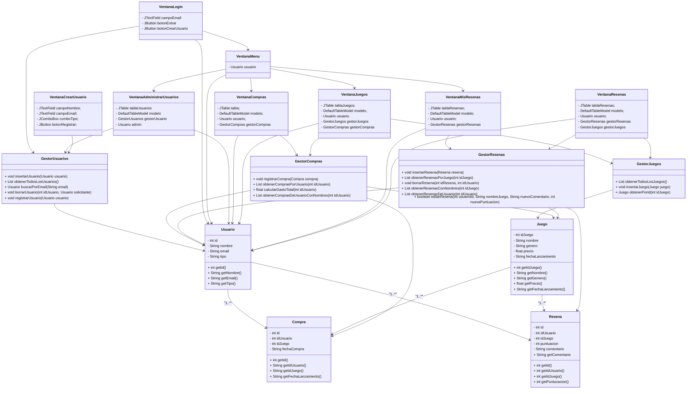

```mermaid
classDiagram

%% ===== Paquete: tablas =====
class Usuario {
    - int id
    - String nombre
    - String email
    - String tipo
    + int getId()
    + String getNombre()
    + String getEmail()
    + String getTipo()
}

class Juego {
    - int idJuego
    - String nombre
    - String genero
    - float precio
    - String fechaLanzamiento
    + int getIdJuego()
    + String getNombre()
    + String getGenero()
    + float getPrecio()
    + String getFechaLanzamiento()
}

class Compra {
    - int id
    - int idUsuario
    - int idJuego
    - String fechaCompra
    + int getId()
    + String getIdUsuario()
    + String getIdJuego()
    + String getFechaLanzamiento()
}

class Resena {
    - int id
    - int idUsuario
    - int idJuego
    - int puntuacion
    - String comentario
    + int getId()
    + int getIdUsuario()
    + int getIdJuego()
    + int getPuntucacion()
    + String getComentario
}

%% ===== Paquete: gestores =====
class GestorUsuarios {
    + void insertarUsuario(Usuario usuario)
    + List<Usuario> obtenerTodosLosUsuarios()
    + Usuario buscarPorEmail(String email)
    + void borrarUsuario(int idUsuario, Usuario solicitante)
    + void registrarUsuario(Usuario usuario)
}

class GestorJuegos {
    + List<Juego> obtenerTodosLosJuegos()
    + void insertarJuego(Juego juego)
    + Juego obtenerPorId(int idJuego)
}

class GestorCompras {
    + void registrarCompra(Compra compra)
    + List<Compra> obtenerComprasPorUsuario(int idUsuario)
    + float calcularGastoTotal(int idUsuario)
    + List<String[]> obtenerComprasDeUsuarioConNombres(int idUsuario)
}

class GestorResenas {
    + void insertarResena(Resena resena)
    + List<Resena> obtenerResenasPorJuego(int idJuego)
    + void borrarResena(int idResena, int idUsuario)
    + List<String[]> obtenerResenasConNombres(int idJuego)
    + List<String[]> obtenerResenasDeUsuario(int idUsuario)
    + boolean editarResena(int usuarioId, String nombreJuego, String nuevoComentario, int nuevaPuntuacion)
}


%% ===== Paquete: vistas =====
class VentanaLogin {
    - JTextField campoEmail
    - JButton botonEntrar
    - JButton botonCrearUsuario
}

class VentanaMenu {
    - Usuario usuario
}

class VentanaAdministrarUsuarios {
    - JTable tablaUsuarios
    - DefaultTableModel modelo
    - GestorUsuarios gestorUsuario
    - Usuario admin
}

class VentanaCompras {
    - JTable tabla;
    - DefaultTableModel modelo;
    - Usuario usuario;
    - GestorCompras gestorCompras
}

class VentanaCrearUsuario {
    - JTextField campoNombre;
    - JTextField campoEmail;
    - JComboBox<String> comboTipo;
    - JButton botonRegistrar;
}

class VentanaJuegos {
    - JTable tablaJuegos;
    - DefaultTableModel modelo;
    - Usuario usuario;
    - GestorJuegos gestorJuegos
    - GestorCompras gestorCompras
}

class VentanaMisResenas {
    - JTable tablaResenas;
    - DefaultTableModel modelo;
    - Usuario usuario;
    - GestorResenas gestorResenas
}

class VentanaResenas {
    - JTable tablaResenas;
    - DefaultTableModel modelo;
    - Usuario usuario;
    - GestorResenas gestorResenas
    - GestorJuegos gestorJuegos
}

%% ===== Relaciones =====
%% ===== Relaciones de entidades =====
Usuario --> Compra : "1..*"
Usuario --> Resena : "1..*"
Juego --> Compra : "1..*"
Juego --> Resena : "1..*"

%% ===== Relaciones con gestores =====
GestorUsuarios --> Usuario
GestorJuegos --> Juego
GestorCompras --> Compra
GestorCompras --> Juego
GestorCompras --> Usuario
GestorResenas --> Resena
GestorResenas --> Usuario
GestorResenas --> Juego

%% ===== Relaciones entre vistas y modelos =====
VentanaLogin --> GestorUsuarios
VentanaLogin --> Usuario
VentanaLogin --> VentanaMenu

VentanaMenu --> Usuario
VentanaMenu --> VentanaJuegos
VentanaMenu --> VentanaCompras
VentanaMenu --> VentanaMisResenas
VentanaMenu --> VentanaAdministrarUsuarios

VentanaAdministrarUsuarios --> GestorUsuarios
VentanaAdministrarUsuarios --> Usuario

VentanaCrearUsuario --> GestorUsuarios

VentanaCompras --> GestorCompras
VentanaCompras --> Usuario

VentanaJuegos --> GestorJuegos
VentanaJuegos --> GestorCompras
VentanaJuegos --> Usuario

VentanaMisResenas --> GestorResenas
VentanaMisResenas --> Usuario

VentanaResenas --> GestorResenas
VentanaResenas --> GestorJuegos
VentanaResenas --> Usuario
```